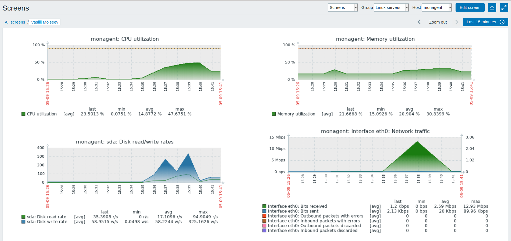

**Задание:**
Настроить дашборд с 4-мя графиками
1) память
2) процессор
3) диск
4) сеть

настроить на одной из систем
- zabbix (использовать screen (комплексный экран))
- prometheus - grafana

***Результат выполнения ДЗ - screen в zabbix:***

В процессе выполнения ДЗ были подняты две виртуальные машины, одна из которых выполняет роль zabbix-сервера, на второй установлен zabbix-агент. 

Процесс ручной установки описан в файле [manual_installation.md](info/manual_installation.md).

Также реализовано автоматическое развертывание сервера и агента zabbix с помощью ansible provisioning, для этого нужно выполнить `vagrant up`. В этом варианте используется база данных MariaDB, так как мне не удалось заставить ansible подключиться к mysql под рутом для создания базы, не смотря на верный пароль и явное указание в файле `my.cnf` использовать для аутентификации плагин `mysql_native_password`. После завершения развертывания нужно будет перейти по адресу http://192.168.11.200/ и завершить настройку zabbix в web-интерфейсе.