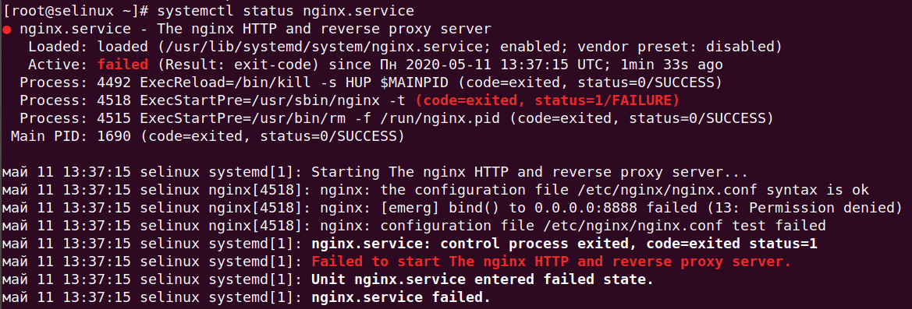
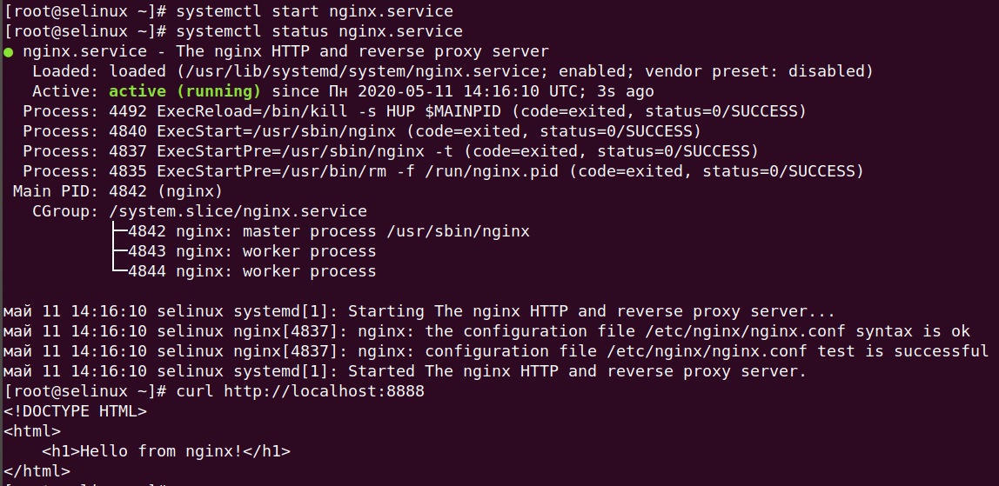
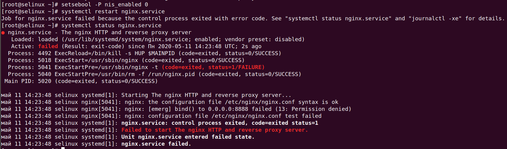
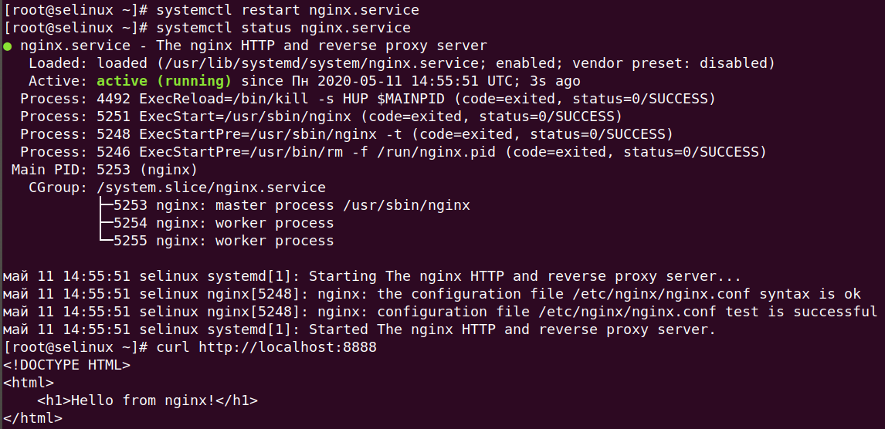
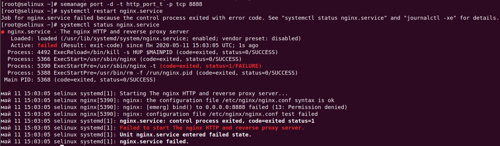
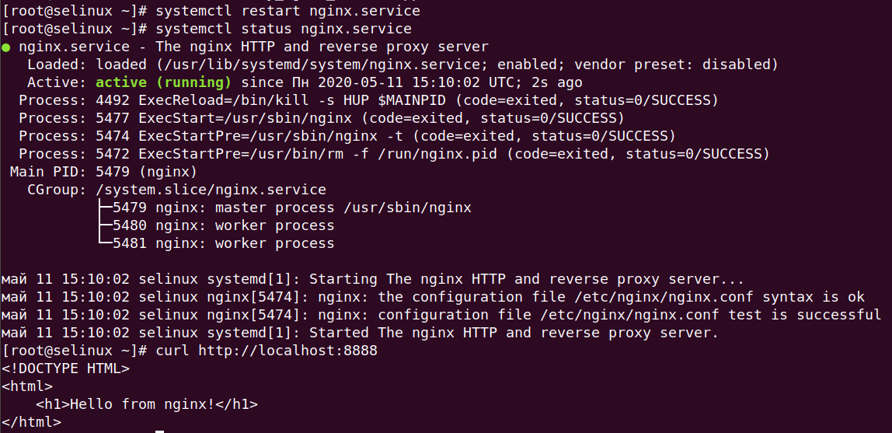
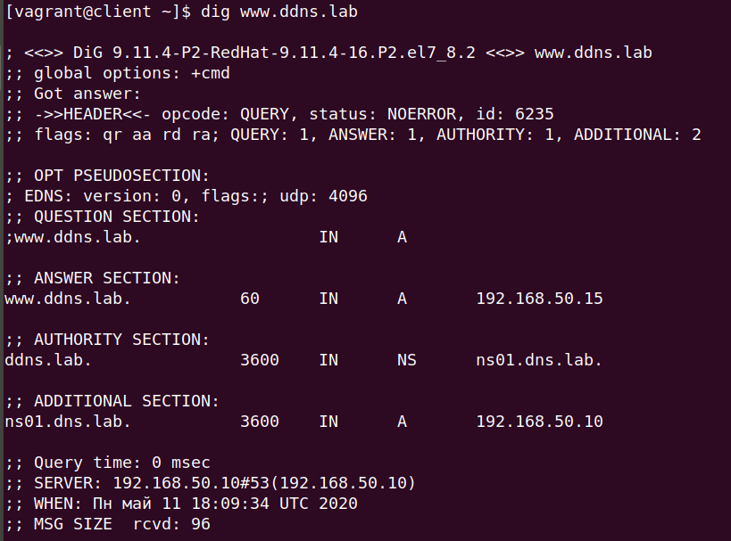

**Практика с SELinux**

***1. Запустить nginx на нестандартном порту 3-мя разными способами:***
- переключатели setsebool;
- добавление нестандартного порта в имеющийся тип;
- формирование и установка модуля SELinux.
К сдаче:
- README с описанием каждого решения (скриншоты и демонстрация приветствуются).

***2. Обеспечить работоспособность приложения при включенном selinux.***
- Развернуть приложенный стенд
https://github.com/mbfx/otus-linux-adm/blob/master/selinux_dns_problems/
- Выяснить причину неработоспособности механизма обновления зоны (см. README);
- Предложить решение (или решения) для данной проблемы;
- Выбрать одно из решений для реализации, предварительно обосновав выбор;
- Реализовать выбранное решение и продемонстрировать его работоспособность.
К сдаче:
- README с анализом причины неработоспособности, возможными способами решения и обоснованием выбора одного из них;
- Исправленный стенд или демонстрация работоспособной системы скриншотами и описанием.

**Выполнение ДЗ**

**1. Запустить nginx на нестандартном порту 3-мя разными способами**

***1.1. Переключатели setsebool***

Изменим порт nginx на 8888, перезапусти nginx.service и проверим, что он не запустился:



С помощью утилиты `sealert` сгенерируем отчет об ошибках из лога SELinux:
```
[root@selinux ~]# sealert -a /var/log/audit/audit.log
```
<details>
  <summary>Получим следующий вывод:</summary>

```
100% done
found 1 alerts in /var/log/audit/audit.log
--------------------------------------------------------------------------------

SELinux is preventing /usr/sbin/nginx from name_bind access on the tcp_socket port 8888.

*****  Plugin bind_ports (92.2 confidence) suggests   ************************

If you want to allow /usr/sbin/nginx to bind to network port 8888
Then you need to modify the port type.
Do
# semanage port -a -t PORT_TYPE -p tcp 8888
    where PORT_TYPE is one of the following: http_cache_port_t, http_port_t, jboss_management_port_t, jboss_messaging_port_t, ntop_port_t, puppet_port_t.

*****  Plugin catchall_boolean (7.83 confidence) suggests   ******************

If you want to allow nis to enabled
Then you must tell SELinux about this by enabling the 'nis_enabled' boolean.

Do
setsebool -P nis_enabled 1

*****  Plugin catchall (1.41 confidence) suggests   **************************

If you believe that nginx should be allowed name_bind access on the port 8888 tcp_socket by default.
Then you should report this as a bug.
You can generate a local policy module to allow this access.
Do
allow this access for now by executing:
# ausearch -c 'nginx' --raw | audit2allow -M my-nginx
# semodule -i my-nginx.pp


Additional Information:
Source Context                system_u:system_r:httpd_t:s0
Target Context                system_u:object_r:unreserved_port_t:s0
Target Objects                port 8888 [ tcp_socket ]
Source                        nginx
Source Path                   /usr/sbin/nginx
Port                          8888
Host                          <Unknown>
Source RPM Packages           nginx-1.16.1-1.el7.x86_64
Target RPM Packages           
Policy RPM                    selinux-policy-3.13.1-266.el7.noarch
Selinux Enabled               True
Policy Type                   targeted
Enforcing Mode                Enforcing
Host Name                     selinux
Platform                      Linux selinux 3.10.0-957.12.2.el7.x86_64 #1 SMP
                              Tue May 14 21:24:32 UTC 2019 x86_64 x86_64
Alert Count                   3
First Seen                    2020-05-11 13:36:54 UTC
Last Seen                     2020-05-11 13:37:15 UTC
Local ID                      bbb0a01d-870b-493d-94c5-f5b89125c013

Raw Audit Messages
type=AVC msg=audit(1589204235.192:846): avc:  denied  { name_bind } for  pid=4518 comm="nginx" src=8888 scontext=system_u:system_r:httpd_t:s0 tcontext=system_u:object_r:unreserved_port_t:s0 tclass=tcp_socket permissive=0


type=SYSCALL msg=audit(1589204235.192:846): arch=x86_64 syscall=bind success=no exit=EACCES a0=6 a1=56417dc9b6b8 a2=10 a3=7fff89962340 items=0 ppid=1 pid=4518 auid=4294967295 uid=0 gid=0 euid=0 suid=0 fsuid=0 egid=0 sgid=0 fsgid=0 tty=(none) ses=4294967295 comm=nginx exe=/usr/sbin/nginx subj=system_u:system_r:httpd_t:s0 key=(null)

Hash: nginx,httpd_t,unreserved_port_t,tcp_socket,name_bind
```

</details>

В выводе видим причину, пот которой nginx не запустился на порту 8888:
```
SELinux is preventing /usr/sbin/nginx from name_bind access on the tcp_socket port 8888.
```
Также утилита предлагает решить проблему несколькими способами, один из которых - с помощью переключателя `setsebool`:
```
If you want to allow nis to enabled
Then you must tell SELinux about this by enabling the 'nis_enabled' boolean.

Do
setsebool -P nis_enabled 1
```
Воспользуемся изменением значения переключателя `nis_enabled` (флаг -P используется для внесения изменений на постоянной основе):
```
[root@selinux ~]# setsebool -P nis_enabled 1
```
После этого запустим nginx и проверим его статус:



***1.2. Добавление нестандартного порта в имеющийся тип***

Вернем значение переключателя `nis_enabled`, перезапустим nginx.service и проверим, что он не запустился:



Выведем список разрешенных SELinux'ом портов для типа http_port_t:
```
[root@selinux ~]# semanage port -l | grep -w http_port_t
http_port_t                    tcp      80, 81, 443, 488, 8008, 8009, 8443, 9000
```
Видим, что нашего порта 8888 в этом списке нет, добавим его:
```
[root@selinux ~]# semanage port -a -t http_port_t -p tcp 8888
[root@selinux ~]# semanage port -l | grep -w http_port_t
http_port_t                    tcp      8888, 80, 81, 443, 488, 8008, 8009, 8443, 9000
```
Рестартанем наш nginx.service и проверим его доступность:



***1.3. Формирование и установка модуля SELinux***

Удалим порт из разрешенных и перезапустим сервис nginx:



Для формирования и установки модуля SELinux воспользуемся утилитой audit2allow, перенаправив на её stdin лог SELinux:
```
[root@selinux ~]# audit2allow -M my_nginx_service < /var/log/audit/audit.log 
******************** IMPORTANT ***********************
To make this policy package active, execute:

semodule -i my_nginx_service.pp
```
В результате будет создан модуль `my_nginx_service.pp`, который нужно установить следующим образом:
```
[root@selinux ~]# semodule -i my_nginx_service.pp
```
Перезапускаем nginx и проверяем:



**2. Обеспечить работоспособность приложения при включенном selinux.**

<details>
  <summary>Суть задания</summary>

```
  Инженер настроил следующую схему:

    ns01 - DNS-сервер (192.168.50.10);
    client - клиентская рабочая станция (192.168.50.15).

При попытке удаленно (с рабочей станции) внести изменения в зону ddns.lab происходит следующее:

[vagrant@client ~]$ nsupdate -k /etc/named.zonetransfer.key
> server 192.168.50.10
> zone ddns.lab
> update add www.ddns.lab. 60 A 192.168.50.15
> send
update failed: SERVFAIL
>

Инженер перепроверил содержимое конфигурационных файлов и, убедившись, что с ними всё в порядке, предположил, что данная ошибка связана с SELinux.

В данной работе предлагается разобраться с возникшей ситуацией.
Задание

    Выяснить причину неработоспособности механизма обновления зоны.
    Предложить решение (или решения) для данной проблемы.
    Выбрать одно из решений для реализации, предварительно обосновав выбор.
    Реализовать выбранное решение и продемонстрировать его работоспособность.
```

</details>

С клиента выполним попытку обновления зоны ddns.lab:
```
[vagrant@client ~]$ nsupdate -k /etc/named.zonetransfer.key
> server 192.168.50.10
> zone ddns.lab
> update add www.ddns.lab. 60 A 192.168.50.15
> send
update failed: SERVFAIL
> quit
```
Проверим ошибки в логе SELinux:
```
[root@ns01 ~]# cat /var/log/audit/audit.log | grep denied
type=AVC msg=audit(1589211171.476:2503): avc:  denied  { search } for  pid=31886 comm="isc-worker0000" name="net" dev="proc" ino=46584 scontext=system_u:system_r:named_t:s0 tcontext=system_u:object_r:sysctl_net_t:s0 tclass=dir permissive=0
type=AVC msg=audit(1589211171.476:2504): avc:  denied  { search } for  pid=31886 comm="isc-worker0000" name="net" dev="proc" ino=46584 scontext=system_u:system_r:named_t:s0 tcontext=system_u:object_r:sysctl_net_t:s0 tclass=dir permissive=0
type=AVC msg=audit(1589214645.931:2563): avc:  denied  { create } for  pid=31886 comm="isc-worker0000" name="named.ddns.lab.view1.jnl" scontext=system_u:system_r:named_t:s0 tcontext=system_u:object_r:etc_t:s0 tclass=file permissive=0
```

Посмотрим вывод утилиты `sealert`:
```
[root@ns01 ~]# sealert -a /var/log/audit/audit.log
```
<details>
  <summary>Вывод:</summary>

```
100% done
found 2 alerts in /var/log/audit/audit.log
--------------------------------------------------------------------------------

SELinux is preventing /usr/sbin/named from search access on the directory net.

*****  Plugin catchall (100. confidence) suggests   **************************

If you believe that named should be allowed search access on the net directory by default.
Then you should report this as a bug.
You can generate a local policy module to allow this access.
Do
allow this access for now by executing:
# ausearch -c 'isc-worker0000' --raw | audit2allow -M my-iscworker0000
# semodule -i my-iscworker0000.pp


Additional Information:
Source Context                system_u:system_r:named_t:s0
Target Context                system_u:object_r:sysctl_net_t:s0
Target Objects                net [ dir ]
Source                        isc-worker0000
Source Path                   /usr/sbin/named
Port                          <Unknown>
Host                          <Unknown>
Source RPM Packages           bind-9.11.4-16.P2.el7_8.2.x86_64
Target RPM Packages           
Policy RPM                    selinux-policy-3.13.1-229.el7_6.12.noarch
Selinux Enabled               True
Policy Type                   targeted
Enforcing Mode                Enforcing
Host Name                     ns01
Platform                      Linux ns01 3.10.0-957.12.2.el7.x86_64 #1 SMP Tue
                              May 14 21:24:32 UTC 2019 x86_64 x86_64
Alert Count                   1
First Seen                    2020-05-11 15:32:51 UTC
Last Seen                     2020-05-11 15:32:51 UTC
Local ID                      10882f72-f2f1-49ac-bc97-43f2a343de62

Raw Audit Messages
type=AVC msg=audit(1589211171.476:2503): avc:  denied  { search } for  pid=31886 comm="isc-worker0000" name="net" dev="proc" ino=46584 scontext=system_u:system_r:named_t:s0 tcontext=system_u:object_r:sysctl_net_t:s0 tclass=dir permissive=0


type=SYSCALL msg=audit(1589211171.476:2503): arch=x86_64 syscall=open success=no exit=EACCES a0=7f3cc3330760 a1=0 a2=1b6 a3=24 items=0 ppid=31884 pid=31886 auid=4294967295 uid=25 gid=25 euid=25 suid=25 fsuid=25 egid=25 sgid=25 fsgid=25 tty=(none) ses=4294967295 comm=isc-worker0000 exe=/usr/sbin/named subj=system_u:system_r:named_t:s0 key=(null)

Hash: isc-worker0000,named_t,sysctl_net_t,dir,search

--------------------------------------------------------------------------------

SELinux is preventing /usr/sbin/named from create access on the file named.ddns.lab.view1.jnl.

*****  Plugin catchall_labels (83.8 confidence) suggests   *******************

If you want to allow named to have create access on the named.ddns.lab.view1.jnl file
Then you need to change the label on named.ddns.lab.view1.jnl
Do
# semanage fcontext -a -t FILE_TYPE 'named.ddns.lab.view1.jnl'
where FILE_TYPE is one of the following: dnssec_trigger_var_run_t, ipa_var_lib_t, krb5_host_rcache_t, krb5_keytab_t, named_cache_t, named_log_t, named_tmp_t, named_var_run_t, named_zone_t.
Then execute:
restorecon -v 'named.ddns.lab.view1.jnl'


*****  Plugin catchall (17.1 confidence) suggests   **************************

If you believe that named should be allowed create access on the named.ddns.lab.view1.jnl file by default.
Then you should report this as a bug.
You can generate a local policy module to allow this access.
Do
allow this access for now by executing:
# ausearch -c 'isc-worker0000' --raw | audit2allow -M my-iscworker0000
# semodule -i my-iscworker0000.pp


Additional Information:
Source Context                system_u:system_r:named_t:s0
Target Context                system_u:object_r:etc_t:s0
Target Objects                named.ddns.lab.view1.jnl [ file ]
Source                        isc-worker0000
Source Path                   /usr/sbin/named
Port                          <Unknown>
Host                          <Unknown>
Source RPM Packages           bind-9.11.4-16.P2.el7_8.2.x86_64
Target RPM Packages           
Policy RPM                    selinux-policy-3.13.1-229.el7_6.12.noarch
Selinux Enabled               True
Policy Type                   targeted
Enforcing Mode                Enforcing
Host Name                     ns01
Platform                      Linux ns01 3.10.0-957.12.2.el7.x86_64 #1 SMP Tue
                              May 14 21:24:32 UTC 2019 x86_64 x86_64
Alert Count                   2
First Seen                    2020-05-11 16:30:45 UTC
Last Seen                     2020-05-11 16:33:57 UTC
Local ID                      df3f2c91-3ace-48f8-9d70-b48bd5e9fbda

Raw Audit Messages
type=AVC msg=audit(1589214837.538:2564): avc:  denied  { create } for  pid=31886 comm="isc-worker0000" name="named.ddns.lab.view1.jnl" scontext=system_u:system_r:named_t:s0 tcontext=system_u:object_r:etc_t:s0 tclass=file permissive=0


type=SYSCALL msg=audit(1589214837.538:2564): arch=x86_64 syscall=open success=no exit=EACCES a0=7f3cc4b7a050 a1=241 a2=1b6 a3=24 items=0 ppid=1 pid=31886 auid=4294967295 uid=25 gid=25 euid=25 suid=25 fsuid=25 egid=25 sgid=25 fsgid=25 tty=(none) ses=4294967295 comm=isc-worker0000 exe=/usr/sbin/named subj=system_u:system_r:named_t:s0 key=(null)

Hash: isc-worker0000,named_t,etc_t,file,create
```

</details>

Видим, что SELinux запрещает утилите `/usr/sbin/named` доступ к созданию файла `named.ddns.lab.view1.jnl`, а также предлагает два варианта решения проблемы:
1й - с помошью утилиты `audit2allow` создать ращрешающий модуль;
2й - с помощью утилиты `semanage` изменить контекст для файла `named.ddns.lab.view1.jnl`.

Создание модулей утилитой `audit2allow` не рекомендуется, так как можно предоставить какому-либо приложению слишком широкие полномочия, в которых оно по сути не нуждается, поэтому воспользуемся 2м способом.

Из файла `/etc/named.conf` узнаем, распололжение файла зоны ddns.lab: `/etc/named/dynamic/named.ddns.lab.view1`. Смотрим тип файла в его контексте безопасности:
```
[root@ns01 ~]# ll -Z /etc/named/dynamic/named.ddns.lab.view1
-rw-rw----. named named system_u:object_r:etc_t:s0       /etc/named/dynamic/named.ddns.lab.view1
```
Видим, что тип - `etc_t`, а из [страницы](https://access.redhat.com/documentation/en-us/red_hat_enterprise_linux/7/html/selinux_users_and_administrators_guide/sect-managing_confined_services-bind-configuration_examples/) руководства RedHat следует, что по умолчанию для динамических зон используется директория `/var/named/dynamic/`, файлы в которой наследуют тип `named_cache_t`. Изменим тип в контексте для директории  `/etc/named/dynamic/`:
```
[root@ns01 ~]# semanage fcontext -a -t named_cache_t '/etc/named/dynamic(/.*)?'
[root@ns01 ~]# restorecon -R -v /etc/named/dynamic/
restorecon reset /etc/named/dynamic context unconfined_u:object_r:etc_t:s0->unconfined_u:object_r:named_cache_t:s0
restorecon reset /etc/named/dynamic/named.ddns.lab context system_u:object_r:etc_t:s0->system_u:object_r:named_cache_t:s0
restorecon reset /etc/named/dynamic/named.ddns.lab.view1 context system_u:object_r:etc_t:s0->system_u:object_r:named_cache_t:s0
```
Повторим попытку изменения зоны ddns.lab:
```
[vagrant@client ~]$ nsupdate -k /etc/named.zonetransfer.key
> server 192.168.50.10
> zone ddns.lab
> update add www.ddns.lab. 60 A 192.168.50.15
> send
> 
> quit
```
Видим, что ошибки нет.




 


