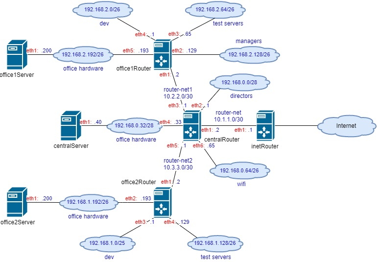

**1. Теоретическая часть**
- Найти свободные подсети
- Посчитать сколько узлов в каждой подсети, включая свободные
- Указать broadcast адрес для каждой подсети
- проверить нет ли ошибок при разбиении

**2. Практическая часть**
- Соединить офисы в сеть согласно схеме и настроить роутинг
- Все сервера и роутеры должны ходить в инет черз inetRouter
- Все сервера должны видеть друг друга
- у всех новых серверов отключить дефолт на нат (eth0), который вагрант поднимает для связи
- при нехватке сетевых интервейсов добавить по несколько адресов на интерфейс

**Топология сети**

***Сеть central***

|       subnet      | network address  |  min address  |  max address  | total hosts |   broadcast   |
|-------------------|:----------------:|--------------:|--------------:|------------:|--------------:|
| directors         | 192.168.0.0/28   | 192.168.0.1   | 192.168.0.14  |     14      | 192.168.0.15  |
| office hardware   | 192.168.0.32/28  | 192.168.0.33  | 192.168.0.46  |     14      | 192.168.0.47  |
| wifi              | 192.168.0.64/26  | 192.168.0.65  | 192.168.0.126 |     62      | 192.168.0.127 |
| свободная подсеть | 192.168.0.16/28  | 192.168.0.17  | 192.168.0.30  |     14      | 192.168.0.31  |
| свободная подсеть | 192.168.0.48/28  | 192.168.0.49  | 192.168.0.62  |     14      | 192.168.0.63  |
| свободная подсеть | 192.168.0.128/25 | 192.168.0.129 | 192.168.0.254 |     126     | 192.168.0.255 |

***Сеть office1***

|       subnet      | network address  |  min address  |  max address  | total hosts |   broadcast   |
|-------------------|:----------------:|--------------:|--------------:|------------:|--------------:|
| dev               | 192.168.2.0/26   | 192.168.2.1   | 192.168.2.62  |     62      | 192.168.2.63  |
| test servers      | 192.168.2.64/26  | 192.168.2.65  | 192.168.2.126 |     62      | 192.168.2.127 |
| managers          | 192.168.2.128/26 | 192.168.2.129 | 192.168.2.190 |     62      | 192.168.2.191 |
| office hardware   | 192.168.2.192/26 | 192.168.2.193 | 192.168.2.254 |     62      | 192.168.2.255 |

***Сеть office2***

|       subnet      | network address  |  min address  |  max address  | total hosts |   broadcast   |
|-------------------|:----------------:|--------------:|--------------:|------------:|--------------:|
| dev               | 192.168.1.0/25   | 192.168.1.1   | 192.168.1.126 |     126     | 192.168.2.127 |
| test servers      | 192.168.1.128/26 | 192.168.1.129 | 192.168.1.190 |     62      | 192.168.2.191 |
| office hardware   | 192.168.1.192/26 | 192.168.1.193 | 192.168.1.254 |     62      | 192.168.2.255 |
